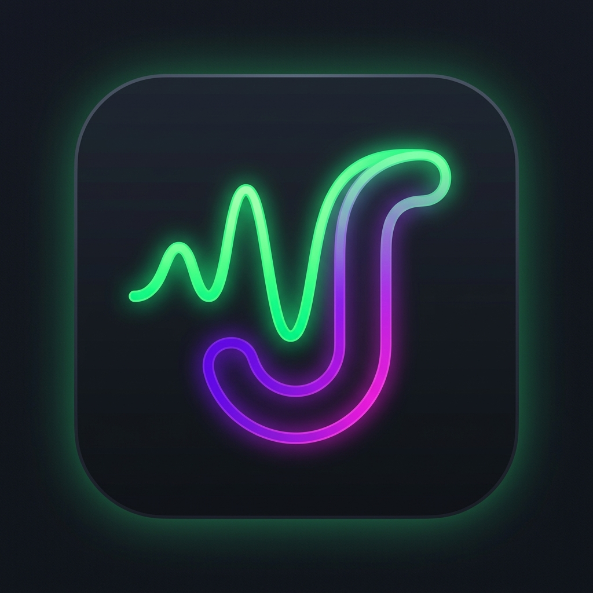

<div align="center">



# JadOO DSP

**Professional-grade audio processing for Android — built from first principles.**

*Because your music deserves better than what your phone gives it out of the box.*

[](#)
[](#)
[](#)
[](#)

</div>

---

## The story

There's a moment most audiophiles know well — you put on a great track, on great headphones, and something still feels *off*. The bass is muddy or missing. The vocals are pushed to one side. The mix sounds compressed, lifeless, glued-together.

JadOO DSP was built to fix that.

Not with simple bass-boost sliders, but with the same signal-processing ideas that live inside professional mixing consoles, mastering studios, and vintage analog gear — rebuilt from scratch, running entirely on your phone, in real time.

---

## What it does

### 🎚 15-Band Graphic EQ
A full-spectrum equalizer spanning **25 Hz to 16 kHz**, with bands aligned to ISO standard centre frequencies. Every cutoff is set to the geometric mean between adjacent bands, so your adjustments land exactly where you intend — not half an octave away.

### 🎛 8-Band Parametric EQ
For the surgically precise. Each band is fully configurable:
- **Filter types**: Peak, Low Shelf, High Shelf, Low-Pass, High-Pass
- **Draggable frequency response graph** — grab the nodes, reshape your sound visually
- **Per-band color coding** so you always know which band you're touching
- **Preamp gain** to compensate for boosts that push levels too hot

### 🧠 Auto-EQ — PsychoacousticsBrain
This is the one that required the most care to get right.

Auto-EQ listens to whatever is playing through a real-time FFT visualizer, builds a rolling spectral picture over a 12-sample window, and quietly nudges the EQ toward a correction target — without you having to do anything. Three target curves are available:

| Mode | Character |
|------|-----------|
| **Harman Curve** | Research-backed consumer preference target. More bass, gentle treble lift |
| **Balanced** | Flat and honest. What the artist intended |
| **Exquisite Mids** | Forward mids, recessed bass and air. Ideal for vocals and acoustic |

The correction glides in smoothly over 2 seconds so you never hear a sudden jump. It waits for at least 4 clean FFT frames before making any moves. It skips silence entirely. And it caps corrections at **±4.5 dB** — enough to fix problems, not enough to wreck a mix.

> *"Auto-EQ should correct actual problems, not push every song toward a template."*
> — source comment, `PsychoacousticsBrain.kt`

### 🎸 Analog Bass Engine
The most complex module in the project. It models the physical and electrical behaviors of vintage analog hardware to produce bass that feels **alive, warm, and three-dimensional**.

The chain runs like this:

```
Input → Pultec EQ → Drift Modulation → 4× Oversampling → Harmonic Saturation → Downsample → DC Block → Output
```

**Pultec EQP-1A emulation** — the famous "simultaneous boost/cut trick." Boosting and cutting the same frequency creates a resonant curve: sub-bass swells, the muddy region just above it dips away. The cut shelf sits ~half an octave above the boost frequency, just like in the original hardware. Parameters: boost (0–8 dB), cut (0–4 dB), four frequency options: 20, 30, 60, 100 Hz.

**Harmonic saturation** — models both even harmonics (warm, smooth — like a single-ended tube) and odd harmonics (punchy, aggressive — like push-pull circuits). The `warmth` control shifts the balance between them. Under the hood: `tanh` soft-clipping combined with polynomial waveshaping.

**Transformer clipping** — asymmetric soft-knee hard-clip that mimics the non-linear headroom behavior of an output transformer core.

**Thermal drift** — two ultra-slow LFOs (0.07 Hz and 0.23 Hz) add micro-level and pitch variation that simulate the mechanical instability of a warm tube circuit. Subtle enough to feel analog, imperceptible as modulation.

**4× oversampling** — all nonlinear processing happens at 4× the device sample rate, then gets filtered back down. This prevents aliasing artifacts that would otherwise appear as harsh metallic distortion.

### 🌟 Hi-Res Upscaler
Adds a gentle air-band lift above 12 kHz — the region that separates high-resolution masters from compressed streaming audio. A single High Shelf filter, applied only when content is present. Transparent at low settings, sparkling at high ones.

### 🎬 HDR Dynamics
Two modes that approach loudness differently:

- **Pure** — removes dynamic compression artifacts by applying a subtle inverse contour. Music breathes again.
- **Restoration** — a more aggressive mode for heavily brickwalled masters. Attempts to restore transient punch and headroom that the mastering engineer destroyed.

### 🔊 Surround+
Stereo widening with one non-negotiable constraint: **vocals stay centered**.

Four modes with increasing intensity:

| Mode | Description |
|------|-------------|
| **Off** | Pass-through |
| **Traditional** | Natural stereo width. Gentle, fatigue-free |
| **Front Stage** | Mid-strength widening aimed at the forward arc. Headphones start to sound like speakers |
| **Ultra Wide** | Maximum 180° virtual soundstage. For movies and ambient music |

The surround engine applies L/R differential gains per EQ band to create the widening effect. The vocal range (1 kHz – 2.5 kHz, bands 8–10) receives **zero differential** — those frequencies always play identically in both ears, keeping the center image locked.

### 🥁 DBFB — Dynamic Bass Feedback
Three modes (Off, Normal, High) that use a multiband compressor in the bass region to dynamically reinforce punch. When DBFB is active, Auto-EQ backs off bass corrections and lets DBFB handle the heavy lifting to avoid double-correction.

---

## Architecture

```
MainActivity (Compose)
    │
    └── JadooDspService (Foreground Service)
            │
            ├── DspEngine         — Android DynamicsProcessing + ParametricEQ wrapper
            ├── DigitalFilterEngine — IIR biquad filter bank (peaking, shelves, HPF/LPF)
            ├── AnalogBassEngine  — Pultec + saturation + drift + oversampling
            ├── PsychoacousticsBrain — Auto-EQ FFT analysis & glide loop
            └── SessionController — Per-app audio session routing
```

The service runs as a **foreground service** with an ongoing notification. Audio effects are applied via Android's `DynamicsProcessing` and `AudioEffect` APIs — no root required. Session detection uses `MediaSessionManager` and a `DumpSys` fallback for apps that don't broadcast sessions.

All state is managed as `StateFlow` and observed by the Compose UI. The service exposes a local `IBinder` so the UI and service share the same process without IPC overhead.

---

## UI Screens

### Dashboard
The main screen. Every module has its own card: toggle on/off, adjust intensity, tap to expand. The active app label and audio session ID are shown live at the top so you always know what's being processed.

### Parametric EQ
A full-screen editor with:
- **Dark frequency response graph** — tap anywhere to add a band, drag nodes to tune
- **Band selector tabs** — jump between bands
- **Filter type pills** — Peak / Low Shelf / High Shelf / LPF / HPF
- **Per-band color picker**
- **Preamp slider** at the bottom

---

## Signal chain order

When everything is enabled, audio flows through the following stages in order:

```
1. Pre-EQ (Graphic EQ manual bands)
2. Analog Bass Engine
3. Parametric EQ (biquad filter bank)
4. HDR Dynamics (DynamicsProcessing MBC)
5. DBFB (DynamicsProcessing MBC, bass bands only)
6. Hi-Res Upscaler (High Shelf, air band)
7. Surround+ (L/R differential per band)
8. Auto-EQ correction overlay
9. Master preamp gain
```

---

## Building

Requirements: Android Studio Hedgehog or later, JDK 17, Android SDK 34.

```bash
git clone https://github.com/rudrakshchatterjee3-creator/Jadoo-DSP
cd Jadoo-DSP
./gradlew assembleRelease
```

The release APK will be at `app/build/outputs/apk/release/JadOO-DSP-release.apk`.

For debug builds with logging:
```bash
./gradlew assembleDebug
adb install app/build/outputs/apk/debug/app-debug.apk
```

---

## Permissions

| Permission | Why |
|------------|-----|
| `RECORD_AUDIO` | Required by Android to attach a `Visualizer` to an audio session for Auto-EQ FFT analysis. No audio is recorded or stored. |
| `BIND_NOTIFICATION_LISTENER_SERVICE` | Detects which app is playing audio so the correct DSP session can be targeted |
| `MODIFY_AUDIO_SETTINGS` | Required for `DynamicsProcessing` / `AudioEffect` |
| `FOREGROUND_SERVICE` | Keeps the DSP service alive while music plays |

---

## Technical notes

- **Sample rate aware**: the engine detects the actual device sample rate via `AudioManager` on startup and reconfigures all filter coefficients accordingly. No hardcoded 48 kHz assumptions.
- **Thread safety**: parameters shared between the UI thread and the DSP thread are declared `@Volatile`. Compound operations (e.g. changing Pultec frequency) are made atomic to prevent applying boost at the new frequency with cut from the old one.
- **No aliasing**: the `AnalogBassEngine` runs all saturation at 4× internal rate with 4th-order Butterworth anti-alias filters on both the up- and downsampling paths.
- **DC blocking**: a 5 Hz high-pass filter after saturation removes any DC offset introduced by asymmetric nonlinear processing.

---

<div align="center">

*Built with obsessive attention to signal quality.*

</div>
